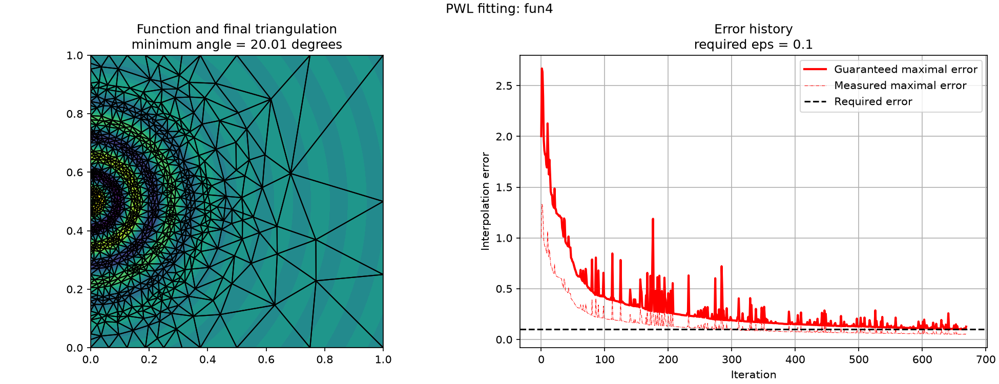

# 2024.1064 - Optimization techniques for modeling with piecewise-linear functions

## Cite

To cite the contents of this repository, please cite both the paper and this repo, using their respective DOIs.

https://doi.org/10.1287/ijoc.2024.1064

https://doi.org/10.1287/ijoc.2024.1064.cd

Below is the BibTex for citing this snapshot of the repository.

```
@misc{PWLOpt,
  author =        {P. Dobrovoczki, T. Kis},
  publisher =     {INFORMS Journal on Computing},
  title =         {{PWLOpt}},
  year =          {2026},
  doi =           {10.1287/ijoc.2024.1064.cd},
  url =           {https://github.com/INFORMSJoC/2024.1064},
  note =          {Available for download at https://github.com/INFORMSJoC/2024.1064},
}  
```
## Description

This repository contains the source code, benchmark instances, and computational experiments accompanying the paper *Optimization techniques for modeling with piecewise-linear functions* by Péter Dobrovoczki and Tamás Kis.

The paper develops optimization techniques for constructing piecewise-linear approximations of multivariate functions and representing the resulting approximations using compact mixed-integer linear programming (MILP) formulations. The repository provides implementations of the proposed algorithms, including the heuristic construction of triangulations and the optimization techniques used to obtain efficient MILP representations.

The computational experiments in the paper evaluate the proposed methods on benchmark instances and include an application to short-term hydropower scheduling. The repository contains also the computational results reported in the paper.


## Repository structure

```text
.
├── src/                    # Python source code
│   └── pwlopt/             # Python library
│       ├── fitting/        # Implementation of PWL function fitting algorithm
│       ├── hydropower/     # Implementation of short-term hydropower scheduling models
│       └── modeling/       # Implementation of modeling tools, e.g. biclique cover algorithm, rank reduction etc.
├── tests/                  # Tests for Delaunay-refinement
├── scripts/                # Scripts to run main algorithms
├── data/                   # Data files for
│   ├── hydro_instances/    # Hydropower benchmark instances
│   ├── simplicizations/    # Random simplicial partitions for rank reduction experiments
│   └── triangulations/     # Triangulation instances
├── results/                # Generated results
│   ├── biclique_cover/     # Results for biclique cover algorithm
│   ├── fitting/            # Results for PWL fitting
│   ├── hydropower/         # Results for hydropower scheduling on various triangulation
│   ├── rank_reduction/     # Results of rank reduction algorithm on 3 and 4 dim. simplicial partitions
│   └── triangle_coloring/  # Blocking hypergraph coloring results
├── notebooks/              # Notebooks for example usage of algorithms
├── cpp/                    # C++ implementation of the maximal Poisson-disk sampling alg.
├── pyproject.toml          # Python project configuration
├── CMakeLists.txt          # CMake file for building sampling alg.
├── AUTHORS                 # Author list
├── LICENSE                 # License file
└── README.md
```

## Requirements
The required packages are listed in `pyproject.toml`. To build and solve the MILP models (the hydropower models and the biclique cover algorithm), a FICO Xpress license is required.

## Hydropower instances

The benchmark instances used in the computational experiments were obtained from the Library of Codes and Instances maintained by the Operations Research group at the University of Bologna:

https://site.unibo.it/operations-research/en/research/library-of-codes-and-instances-1

The instances originate from:

> **Borghetti et al. (2008)** *An MILP Approach for Short-Term Hydro Scheduling and Unit Commitment With Head-Dependent Reservoir*, IEEE Transactions on Power Systems, 23(3), 1115-1124.

The instance files found in `data/hydro_instances` were interpreted from `.lp` files in the original distribution.

For licensing and redistribution terms, see the original source.

## Running the hydropower script

The `scripts/run_hydropower.py` script solves a hydropower instance using a stored triangulation. The triangulation path is relative to `data/triangulations`, and the month selects the corresponding directory under `data/hydro_instances`. Results are printed as JSON unless `--output` is specified.

```powershell
python scripts/run_hydropower.py adaptive/inst005.txt June
python scripts/run_hydropower.py adaptive/inst005.txt June --formulation dlog --output results/hydropower/run.json
```

Available formulations are `cc`, `dcc`, `dlog`, `gib`, and `inc`. For GIB, an existing biclique cover can be loaded from `results/biclique_cover`:

```powershell
python scripts/run_hydropower.py adaptive/inst005.txt June --formulation gib --biclique-cover adaptive/inst005.json
```

If `--biclique-cover` is omitted, the GIB model computes the cover automatically and reports the biclique-cover solution progress on the console.

Grid triangulations use the `log_grid` formulation and must be given a grid triangulation file:

```powershell
python scripts/run_hydropower.py grid/inst4.txt June --formulation log_grid
```

The `--grid` option is an alias for `--formulation log_grid`. Solver controls include `--time-limit`, `--threads`, and `--quiet`. A FICO Xpress license is required to solve the model.

### Running the fitting script

The `scripts/fit_function.py` script estimates a function's Lipschitz constant with interval branch-and-bound and runs the adaptive PWL fitting algorithm. Functions must be defined in `pwlopt.fitting.functions` and have a matching interval gradient function named `iv<function>_gradnorm`.

```powershell
python scripts/fit_function.py fun2 --eps 0.01 --min-angle 20
python scripts/fit_function.py fun2 --eps 0.01 --min-angle 20 --output results/fitting/fun2.txt --plot results/fitting/fun2.png
```

The `--output` option writes the final triangulation in the repository's triangulation format. The optional `--plot` output contains the function and final triangulation on the same axis, along with the fitting error history. Lipschitz estimation tolerances can be adjusted with `--lipschitz-ftol` and `--lipschitz-dtol`.

### Running the biclique cover script

The `scripts/compute_biclique_cover.py` script reads a triangulation relative to `data/triangulations`, computes its biclique cover, and optionally writes the cover as JSON. The output format is compatible with the GIB hydropower formulation.

```powershell
python scripts/compute_biclique_cover.py adaptive/inst005.txt
python scripts/compute_biclique_cover.py adaptive/inst005.txt --output results/biclique_cover/adaptive/inst005.json
```

Use `--time-limit` to set the time limit in seconds for each biclique subproblem. Computing a cover requires a FICO Xpress license.
